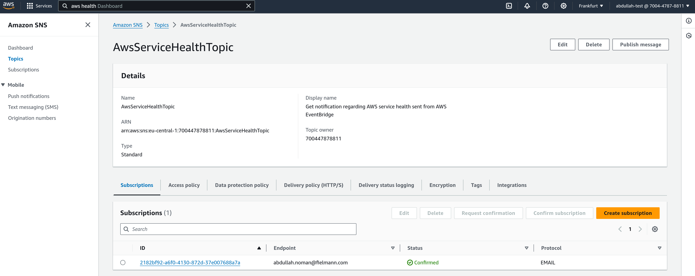
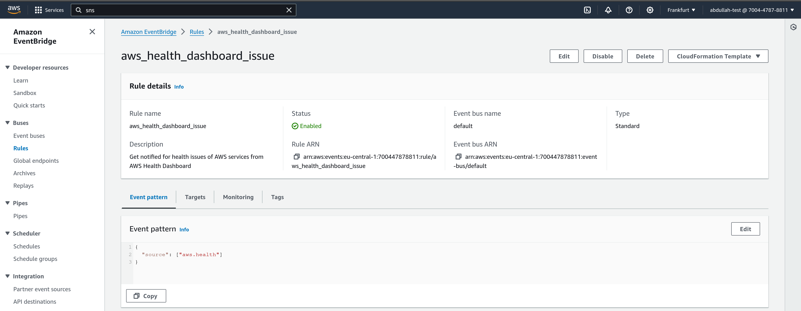
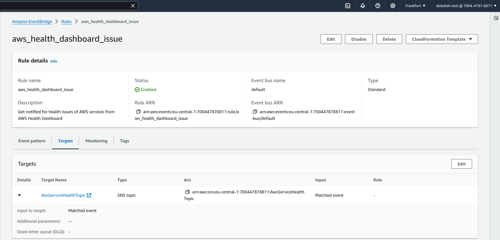

# Week 0 — Billing and Architecture

## Homework challenges
### Use EventBridge to hookup Health Dashboard to SNS and send notification when there is a service health issue
In order to solve this challenge I performed the following steps from AWS console:
1. Create a SNS topic:
   

2. Create an EventBridge rule and use the SNS topic from the previous step as a `Target` for that rule
   
   

